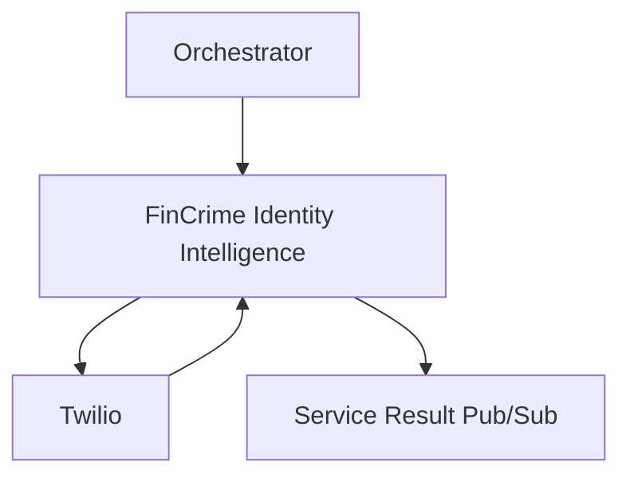

# FinCrime Identity Intelligence (previously Sim Intelligence)
This repository is a microservice for Identity Intelligence.

## Purpose
This system is used to consult important information from partners about customer's phone number.

## Datadog Dashboard
https://app.datadoghq.com/dashboard/mvm-3te-d2d/financial-crime---identity-intelligence-service

### Monitors
-   [CPU is above 80% of limit for past 5 minutes](https://app.datadoghq.com/monitors/135301959)
-   [Excessive errors logged](https://app.datadoghq.com/monitors/135302012)
-   [Health Check Failure (drops below 60% of total allocated instances)](https://app.datadoghq.com/monitors/135302083)
-   [Memory is above 75% of limit for past 5 minutes](https://app.datadoghq.com/monitors/135302095)
-   [Message anomaly](https://app.datadoghq.com/monitors/135303379)

### Health Check
https://fc-Identity-intelligence-default.{env}.q3.questech.io/healthz

## Service and Dependencies


## Team Contact Information
Slack Channel: #team-tmj
Alerts Channel: #fincrime-fraud-aml-alerts
Email group: questrade-scrumteam-tmj@questrade.com

## Production readiness checklist
[Checklist link](productionreadiness.md)

## Development setup

### Pub/Sub Emulator
To run the project locally you'll need to install a Pub/Sub Emulator, you can have more information here:

https://confluence.questrade.com/display/CLP/Pub-Sub+emulator+setup

After install Pub/Sub emulator you need to set:
-   A project called qt-msa-local if it does not exists
-   A topic called system.financial-crime.internal-phone-number.scan-1.0
-   A subscription called system.financial-crime.internal-phone-number.scan-1.0

### Running Unit Test
```
dotnet test  src/UnitTests/UnitTests.csproj
```

### Running Integration Tests
Before executing the integration tests locally we'll need to execute the following command in terminal:
```
docker-compose -f ./docker/DevEnvironment/docker-compose.yml up -d
```

This will create and run one container in background:
- identity-intelligence-pubsub-emulator

Our integration tests will use this emulator to create our temporary topics, subscriptions and to publish any necessary messages to the tests, in a safe and controlled local environment.

# More information
-   Twilio is a Questrade's partner who delivery information about customer phone number
-   FinCrime Orchestrator is a internal application who trigger identity intelligence when it is needed
-   Service Result Pub/Sub the will receive a message from fin crime intelligences (email, name and identity intelligence)
